# Crown Trader
Final project for course *Application Development for iOS 2*, taught at [PEF MENDELU](https://pef.mendelu.cz/), graded 36/40 points (due to absence of tests)

## Table of Contents
- [Description](#description)
- [Features](#features)
  - [Mobile App](#mobile-app)
  - [Watch App](#watch-app)
- [Architecture & Data Flow](#architecture--data-flow)
- [Usage](#usage)
- [Installation](#installation)
- [License](#license)


## Description

**Crown Trader** is an iOS application developed in Swift that allows users to explore, track, and simulate stock trading. The project consists of two synchronized apps:

- **Mobile App:** Offers detailed stock information, trading simulation, news, and personalized watchlists.
- **Watch App:** Provides a streamlined experience with key stock data and portfolio management directly on your wrist.


## Features

### Mobile App

- **Main Page (Markets)**
  - **Predefined Stocks List:**  
    Displays a list of stocks including the stock name, symbol, current price, and the 24-hour percentage change.
  - **Interactive Chart:**  
    Tapping on a stock updates the chart at the top of the screen. Users can switch between different time intervals: 1 day, 3 months, 6 months, and 1 year.
  - **Global Search:**  
    A search bar is present on every screen (except the News screen) for quick access to stocks.

- **Stock Preview Modal**
  - **Detailed View:**  
    When a stock is searched and selected from the search results, a modal window is presented with:
    - An interactive chart with time intervals (1d, 3mo, 6mo, 1y).
    - Stock details including name, symbol, volume, 24-hour percentage change, and averages for the last 30 and 60 days.
  - **Actions:**  
    Options to "Watch" or "Buy" the stock are available, with the current price displayed in dollars.

- **Watchlist Screen**
  - **Personalized Watchlist:**  
    Displays stocks that have been added to the watchlist.
  - **Interactive Detail:**  
    Tapping a stock opens the Stock Preview Modal where the "Watch" option changes to "Unwatch" for removal.

- **Snaps Screen (Portfolio Simulator)**
  - **Account Overview:**  
    Shows profit, profit percentage, and available money to invest.
  - **Account Actions:**  
    - **Add Money:** Increase the available funds.
    - **Reset Account:** Reset the account and portfolio.
  - **Trading Simulation:**  
    Stocks purchased via the Stock Preview Modal appear in this section with details such as symbol, name, actual purchase price (with market updates), and percentage change since purchase.
  - **Selling Stocks:**  
    Selling stocks updates the available balance and recalculates profit.

- **News Screen**
  - **News Feed:**  
    Displays a list of news items with images and titles.
  - **News Detail:**  
    Tapping on a news item opens a preview screen showing a larger image and detailed description.


### Watch App

- **Synchronized Experience:**  
  The Watch app synchronizes with the Mobile app, ensuring that any changes in the watchlist or portfolio are updated across both platforms.
- **Menu Navigation:**  
  - **Markets:** Access the predefined stocks available on the Mobile App’s main page.
  - **Watchlist:** View and manage your watchlist.
  - **Snaps:** Manage your simulated portfolio.
- **Stock Detail:**
  - Each stock card includes a chart, stock name, current price, and daily change.
  - **Action Buttons:**  
    - **Unwatch:** Remove a stock from the watchlist.
    - **Sell:** Execute a sell action for stocks in the portfolio.


## Architecture & Data Flow

- **Data Persistence:**  
  Utilizes **CoreData** to store stock data, user balances, and transaction history locally, providing fast offline access.
- **Data Fetching:**  
  Stock information (e.g., prices, volume, percentage changes) is fetched from an external API to ensure real-time updates.
- **Synchronization:**  
  Both the Mobile and Watch apps are synchronized so that any modifications (adding/removing stocks, trading actions) are reflected across both devices.


## Usage

- **Exploring Stocks:**  
  Tap on any stock on the main page to view detailed charts and market data. Use the search bar to quickly locate specific stocks.

- **Managing Your Watchlist:**  
  Add stocks to your watchlist from the Stock Preview Modal and manage them on the Watchlist screen.

- **Simulated Trading:**  
  - Purchase stocks using the available funds in your simulated portfolio.
  - Monitor your investments in the Snaps screen.
  - Sell stocks to update your available balance and calculate profit.

- **Staying Informed:**  
  Browse the News screen for the latest market news and detailed articles.

- **On Your Wrist:**  
  Use the Watch app for quick access to market data, watchlist management, and portfolio updates while on the go.


## Installation

1. **Clone the Repository:**

    ```bash
   git clone https://github.com/JiriSuster/crowntrader.git
   cd crowntrader
    ```

2. **Open in Xcode:**
   - Open the project using `CrowTrader.xcodeproj`.


4. **Build and Run:**
   - Select the desired scheme (Mobile or Watch app) in Xcode.
   - Run on your simulator or connected device.


## Authors

- [David Krčmář](https://www.linkedin.com/in/david-krcmar-943182235/)
- [Jiří Daniel Šuster](https://www.linkedin.com/in/ji%C5%99%C3%AD-daniel-%C5%A1uster-7017b0306/)


## Screenshots

### Phone
<div style="display: flex; flex-wrap: wrap;">
  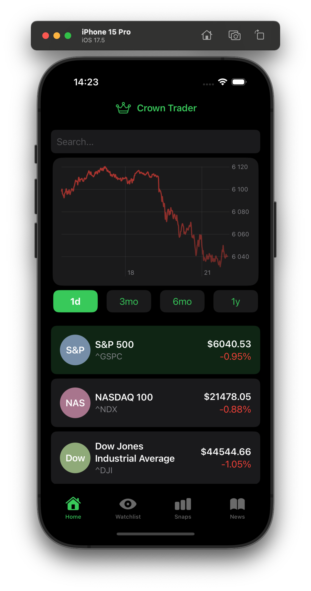
  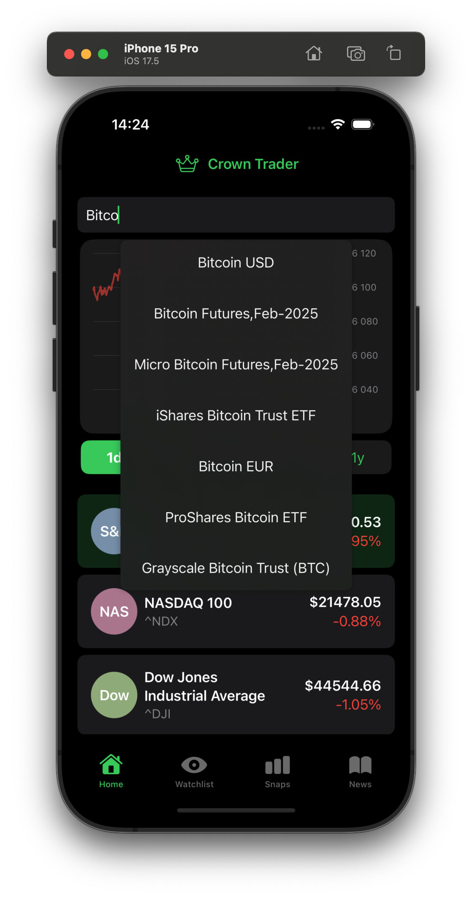
  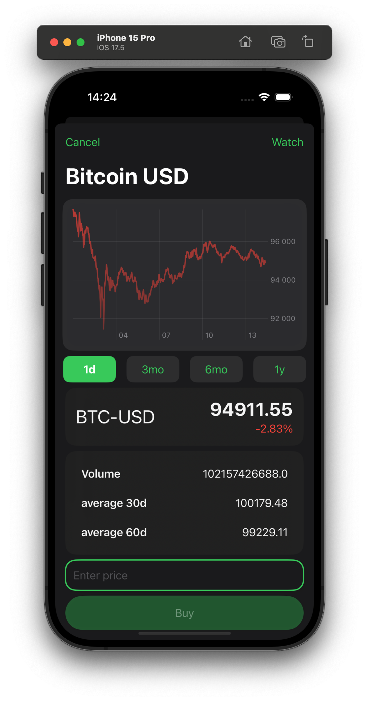
  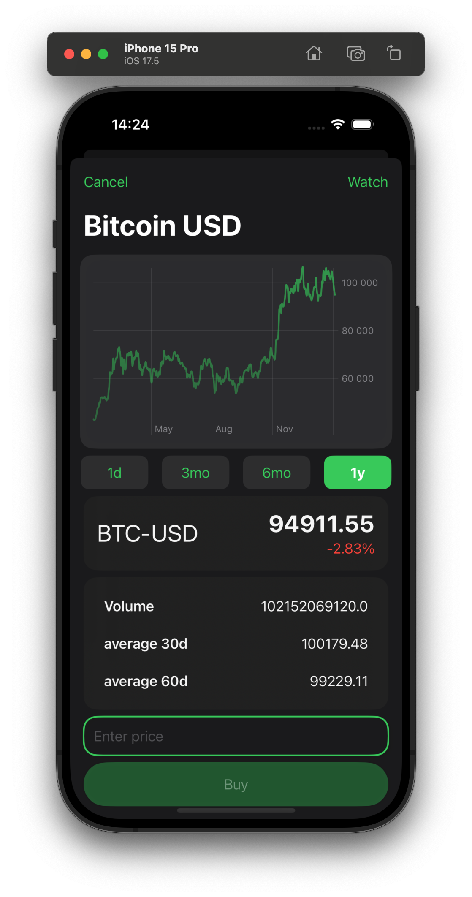
  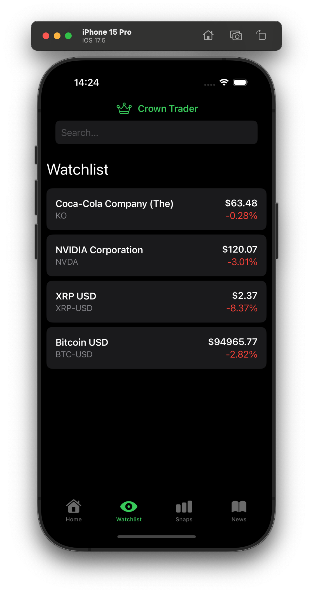
  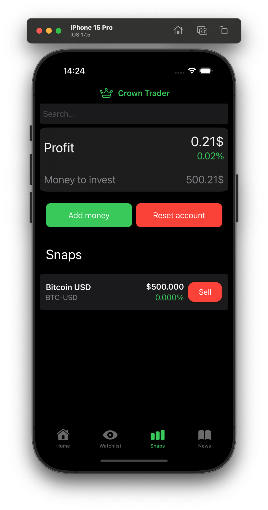
  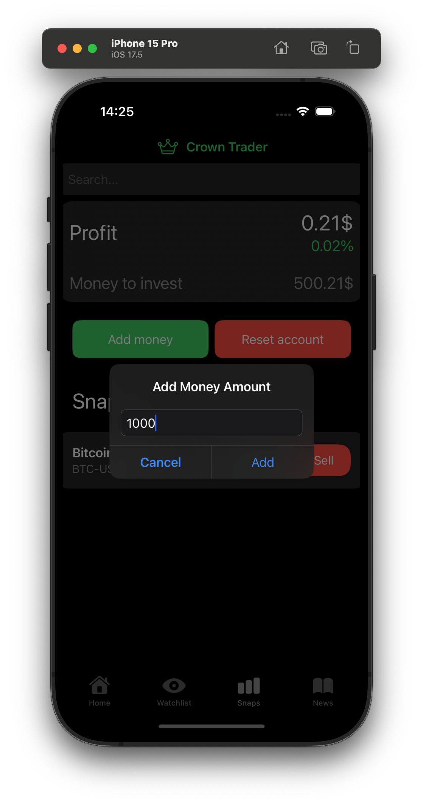
  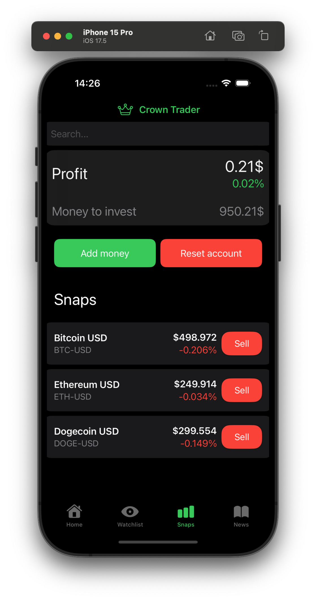
  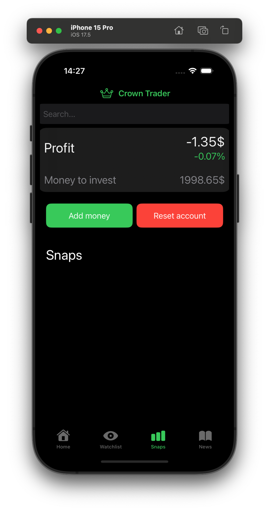
  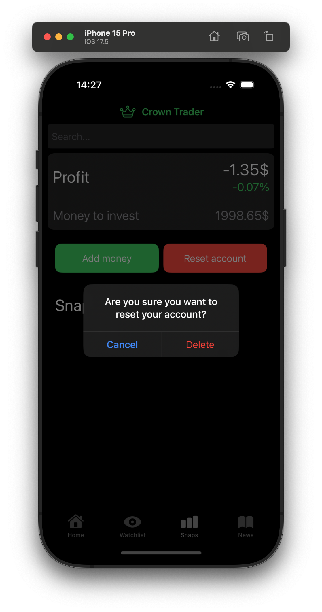
  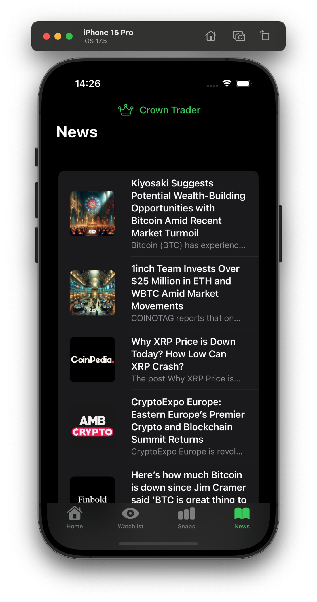
  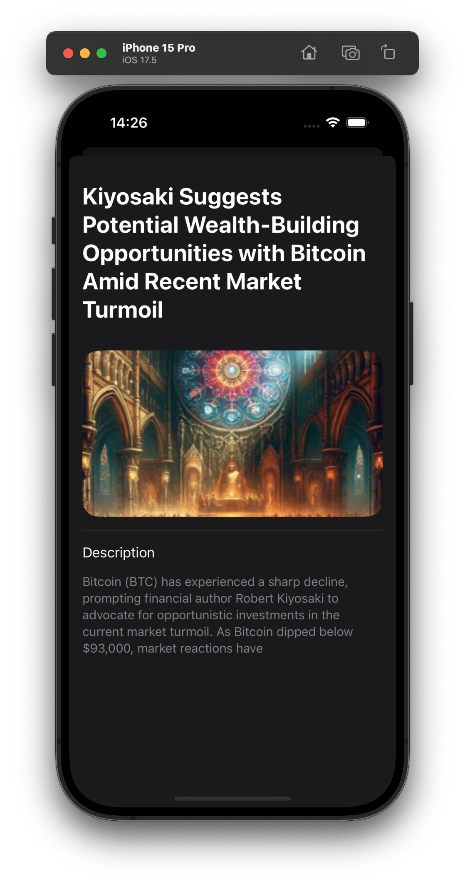
</div>

### Watch
<p align="left">
  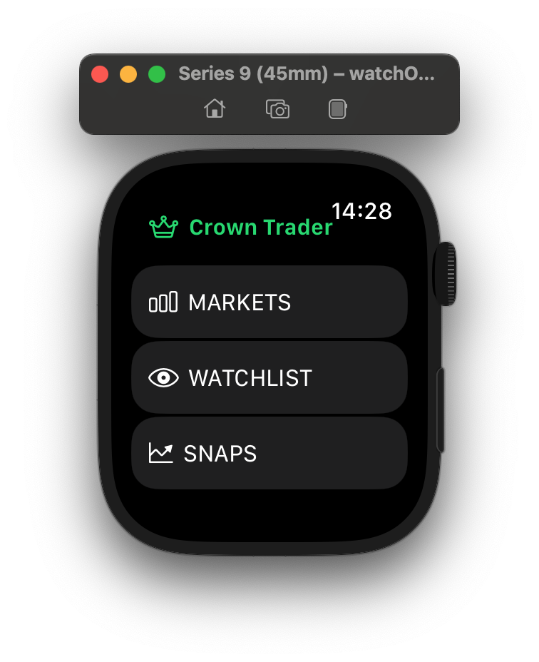
  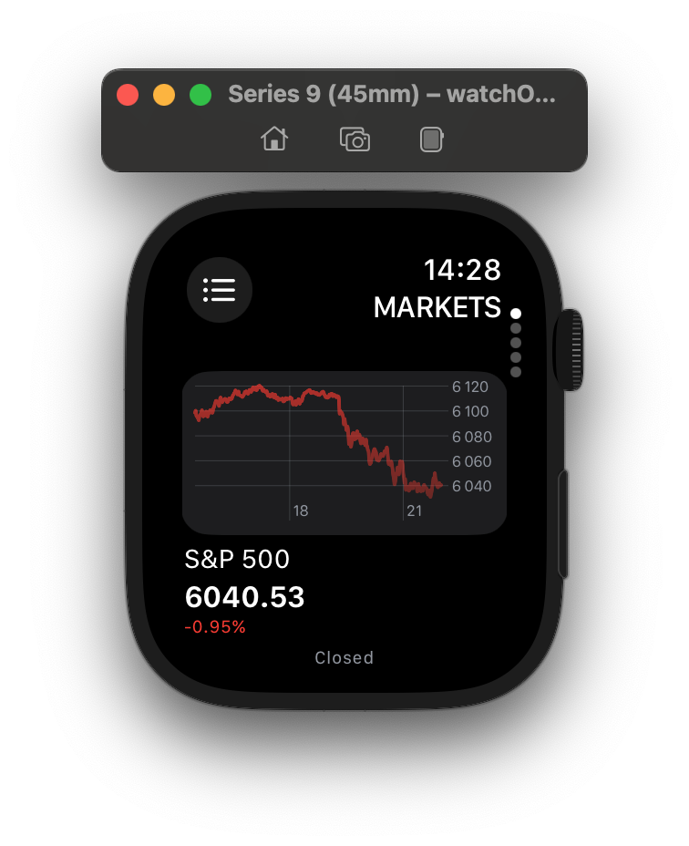
  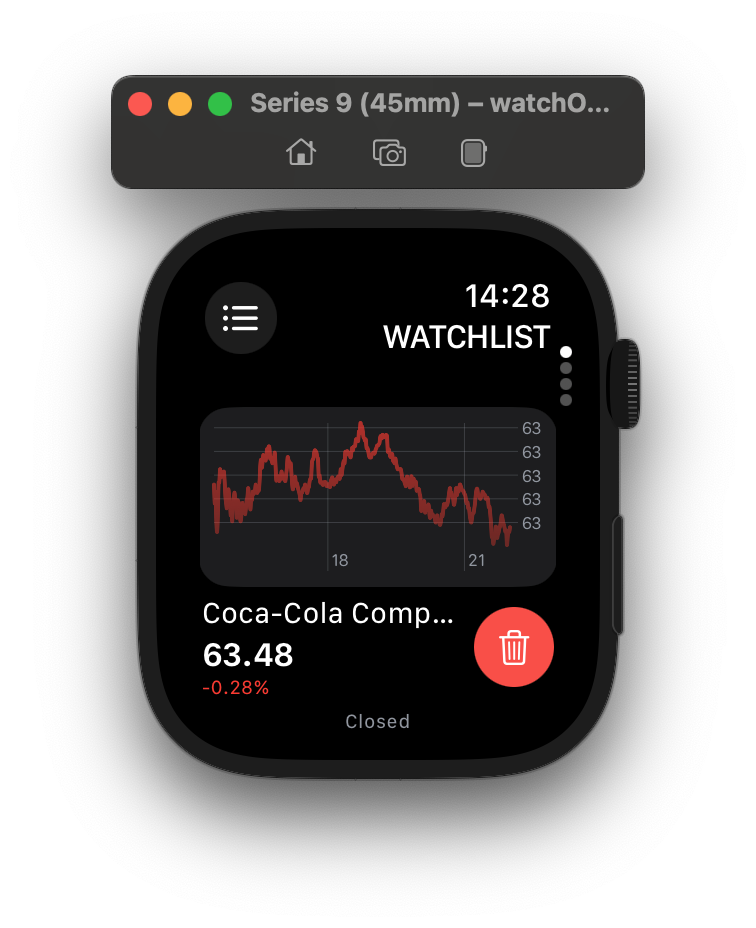
  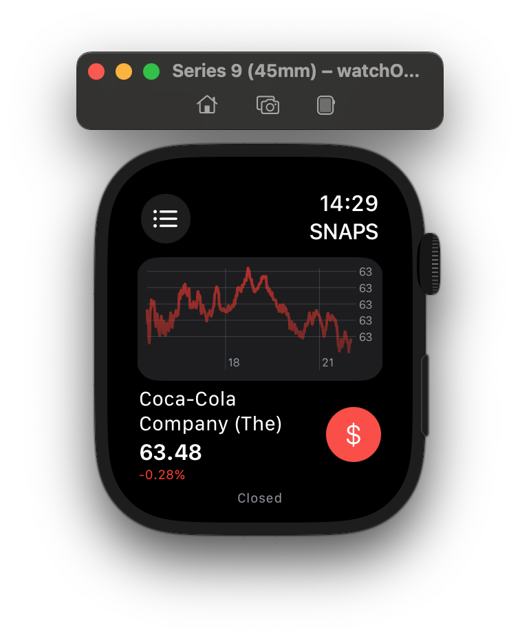
</p>

## Video
[](https://www.youtube.com/watch?v=b52ioQzoBHA)

## License

[MIT](https://choosealicense.com/licenses/mit/)
